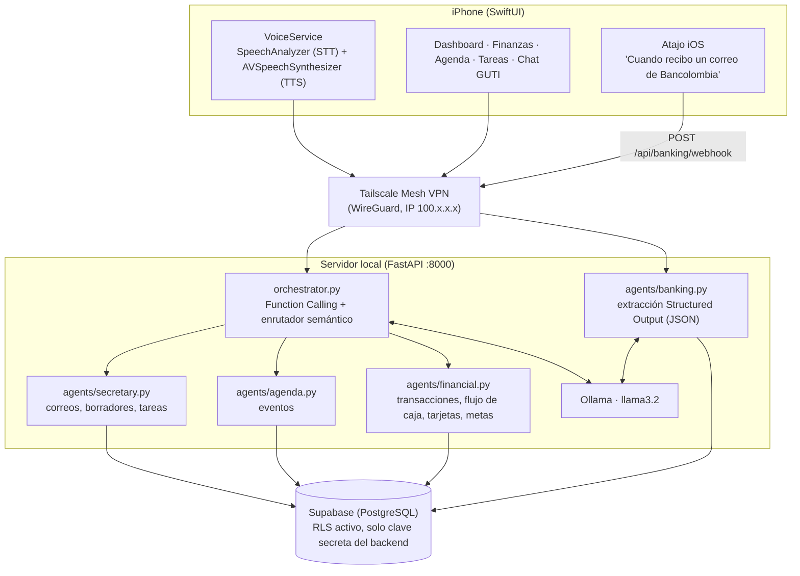
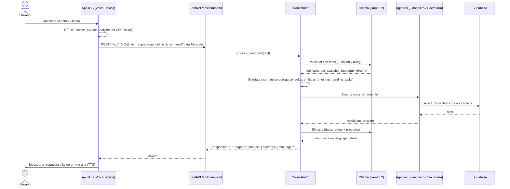
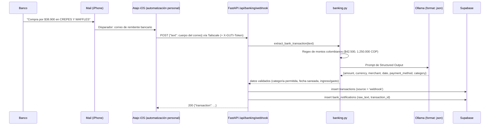
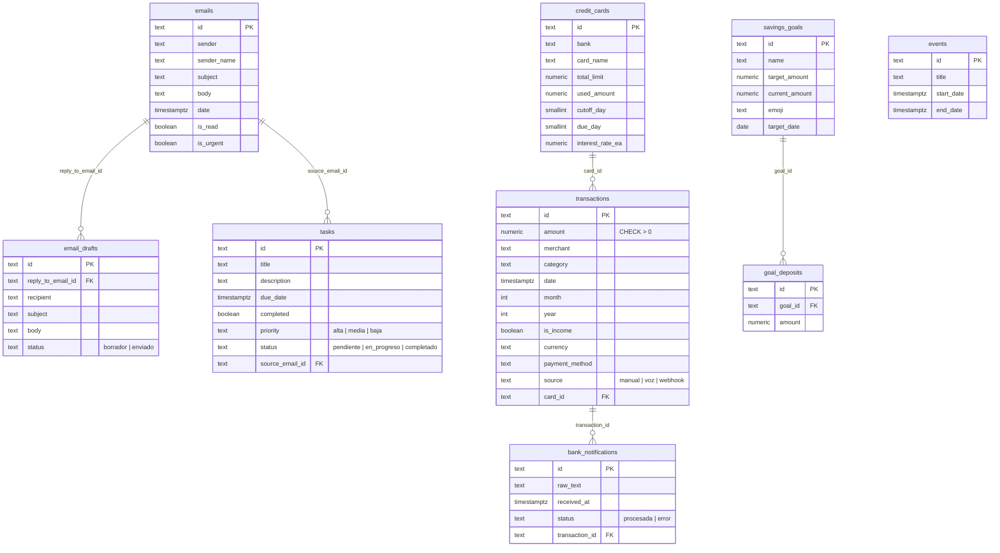

# GUTI — Documento Técnico de Arquitectura

## 1. Topología

**Seguridad de red:** el backend no se expone a internet. El iPhone lo alcanza por la IP privada de Tailscale
(`100.x.x.x:8000`) incluso con datos móviles, sin abrir puertos del router ni túneles públicos (ngrok, etc.).
Supabase solo recibe tráfico del backend usando la clave secreta; la app nunca tiene credenciales de base de datos.
El webhook bancario acepta opcionalmente un secreto compartido en el header `X-GUTI-Token`.

## 2. Diagrama de secuencia — comando por voz

## 3. Diagrama de secuencia — ingesta cero-fricción

## 4. Esquema relacional

Definido en [`backend/schema.sql`](../backend/schema.sql).

Reglas de integridad:
- `ON DELETE CASCADE` en `goal_deposits` (sin meta no hay abonos).
- `ON DELETE SET NULL` en el resto de FKs: borrar un correo o tarjeta no borra tareas ni transacciones históricas.
- `CHECK` en montos positivos, días de corte 1–31 y estados enumerados.

## 5. Herramientas del orquestador (Function Calling)

| Agente | Herramienta | Acción |
| --- | --- | --- |
| Financiero | `get_financial_summary` | Ingresos, gastos y gasto por categoría del mes |
| Financiero | `get_available_budget` | Liquidez libre y presupuesto sugerido para el periodo |
| Financiero | `get_credit_cards_status` | Cupos, fechas de corte/pago e interés mensual estimado |
| Financiero | `get_savings_goals` | Avance porcentual de metas de ahorro |
| Financiero | `add_transaction` | Registro de gasto/ingreso por voz |
| Secretaría | `check_emails` | Búsqueda de correos (p. ej. respuesta del decano) |
| Secretaría | `draft_email` | Borrador formal, queda pendiente de confirmación |
| Secretaría | `get_pending_tasks` / `add_task` / `complete_task` | Gestión de pendientes |
| Secretaría (agenda) | `get_upcoming_events` / `schedule_event` | Citas y reuniones |

Si el LLM no emite `tool_calls` o deja por fuera parte de una pregunta mixta, un enrutador semántico
determinista (palabras clave normalizadas sin tildes) completa las consultas, y la respuesta se marca
como `multi-agent` cuando intervienen ambos agentes.
